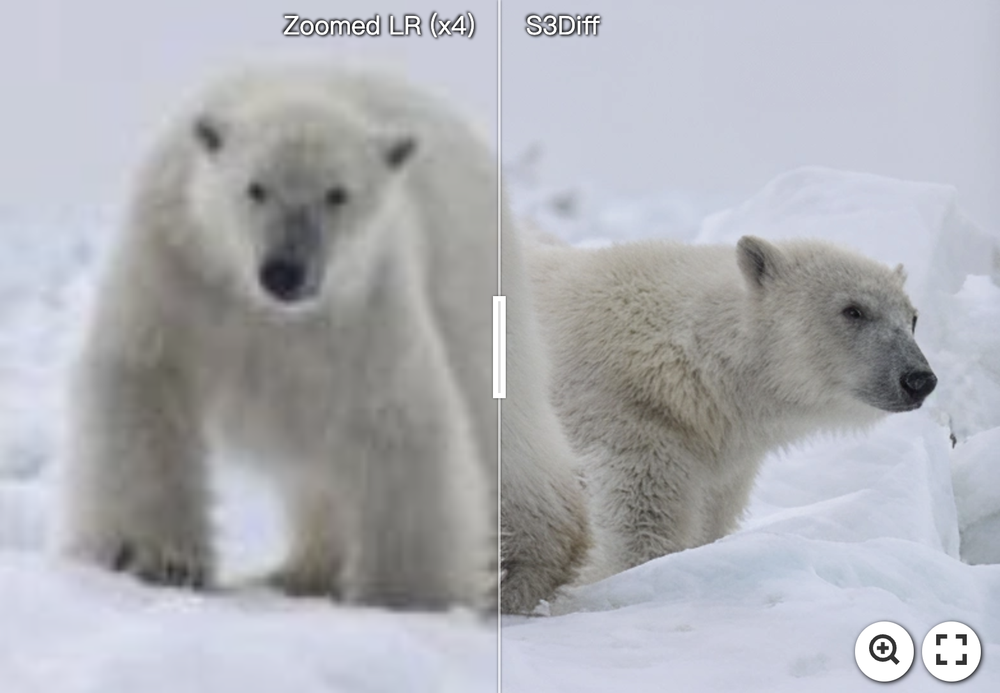
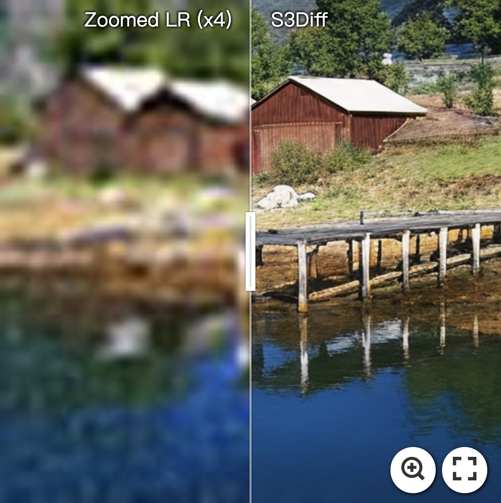
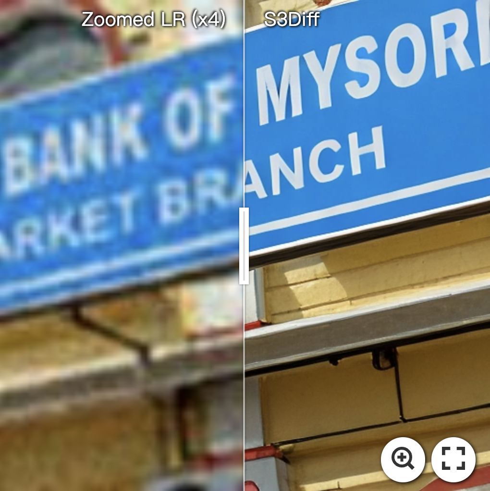
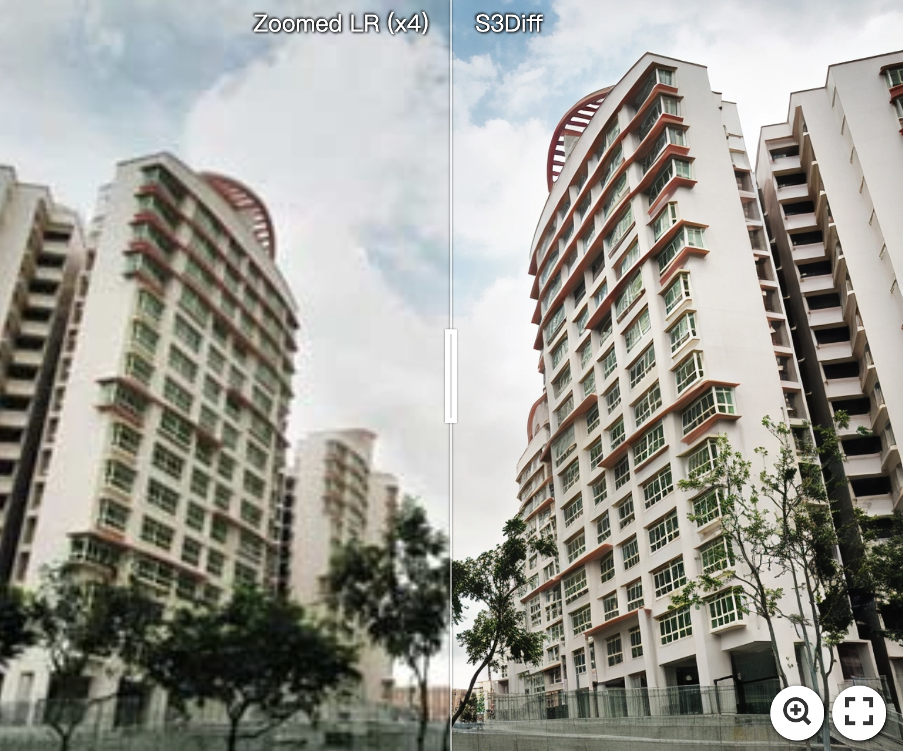
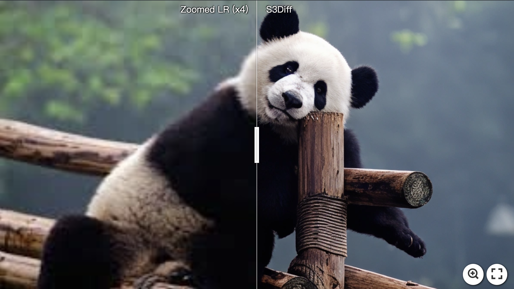
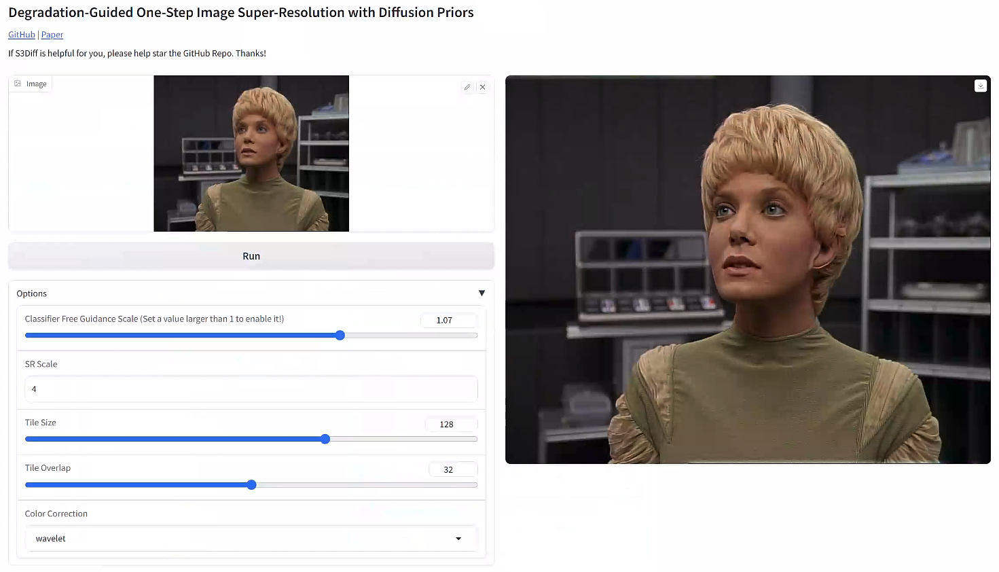

<h2 align="center">Degradation-Guided One-Step Image Super-Resolution with Diffusion Priors</h2>

<div align="center">

<a href="https://arxiv.org/abs/2409.17058"></a>  &nbsp;&nbsp;&nbsp;&nbsp;&nbsp;

</p>

[Aiping Zhang]()<sup>1\*</sup>, [Zongsheng Yue]()<sup>2,\*</sup>, [Renjing Pei]()<sup>3</sup>, [Wenqi Ren]()<sup>1</sup>, [Xiaochun Cao]()<sup>1</sup>

<sup>1</sup>School of Cyber Science and Technology, Shenzhen Campus of Sun Yat-sen University<br> <sup>2</sup>S-Lab, Nanyang Technological University<br> <sup>3</sup>Huawei Noah's Ark Lab<br>* Equal contribution.
</div>

:fire::fire::fire: We have released the code, cheers!


:star: If S3Diff is helpful for you, please help star this repo. Thanks! :hugs:


## :book: Table Of Contents

- [Update](#update)
- [TODO](#todo)
- [Abstract](#abstract)
- [Framework Overview](#framework_overview)
- [Visual Comparison](#visual_comparison)
- [Setup](#setup)
- [Training](#training)
- [Inference](#inference)

<!-- - [Installation](#installation)
- [Inference](#inference) -->

## <a name="update"></a>:new: Update

- **2024.10.07**: Add gradio demo 🚀
- **2024.09.25**: The code is released :fire:
- **2024.09.25**: This repo is released :fire:
<!-- - [**History Updates** >]() -->

## <a name="todo"></a>:hourglass: TODO

- [x] Release Code :computer:
- [x] Release Checkpoints :link:

## <a name="abstract"></a>:fireworks: Abstract

> Diffusion-based image super-resolution (SR) methods have achieved remarkable success by leveraging large pre-trained text-to-image diffusion models as priors. However, these methods still face two challenges: the requirement for dozens of sampling steps to achieve satisfactory results, which limits efficiency in real scenarios, and the neglect of degradation models, which are critical auxiliary information in solving the SR problem. In this work, we introduced a novel one-step SR model, which significantly addresses the efficiency issue of diffusion-based SR methods. Unlike existing fine-tuning strategies, we designed a degradation-guided Low-Rank Adaptation (LoRA) module specifically for SR, which corrects the model parameters based on the pre-estimated degradation information from low-resolution images. This module not only facilitates a powerful data-dependent or degradation-dependent SR model but also preserves the generative prior of the pre-trained diffusion model as much as possible. Furthermore, we tailor a novel training pipeline by introducing an online negative sample generation strategy. Combined with the classifier-free guidance strategy during inference, it largely improves the perceptual quality of the super-resolution results. Extensive experiments have demonstrated the superior efficiency and effectiveness of the proposed model compared to recent state-of-the-art methods.

## <a name="framework_overview"></a>:eyes: Framework Overview


:star: Overview of S3Diff. We enhance a pre-trained diffusion model for one-step SR by injecting LoRA layers into the VAE encoder and UNet. Additionally, we employ a pre-trained Degradation Estimation Network to assess image degradation that is used to guide the LoRAs with the introduced block ID embeddings. We tailor a new training pipeline that includes an online negative prompting, reusing generated LR images with negative text prompts. The network is trained with a combination of a reconstruction loss and a GAN loss.

## <a name="visual_comparison"></a>:chart_with_upwards_trend: Visual Comparison

### Image Slide Results
[](https://imgsli.com/MzAzNjIy) [](https://imgsli.com/MzAzNjQ1)  [](https://imgsli.com/MzAzNjU4)
[](https://imgsli.com/MzAzNjU5) [](https://imgsli.com/MzAzNjI2)
### Synthesis Dataset


### Real-World Dataset


<!-- </details> -->

## <a name="setup"></a> ⚙️ Setup
```bash
conda create -n s3diff python=3.10
conda activate s3diff
pip install -r requirements.txt
```
Or use the conda env file that contains all the required dependencies.

```bash
conda env create -f environment.yaml
```

:star: Since we employ peft in our code, we highly recommend following the provided environmental requirements, especially regarding diffusers.


## <a name="training"></a> :wrench: Training

#### Step1: Download the pretrained models
Download the pretrained model [SD-Turbo](https://huggingface.co/stabilityai/sd-turbo)

#### Step2: Prepare training data
We train the S3Diff on [LSDIR](https://github.com/ofsoundof/LSDIR), following [SeeSR](https://github.com/cswry/SeeSR) and [OSEDiff](https://github.com/cswry/OSEDiff).

#### Step3: Training for S3Diff

Please modify the paths to datasets in `configs/sr.yaml` and the paths to pretrained model in `run_training.sh`
Then run:

```bash
sh run_training.sh
```

## <a name="inference"></a> 💫 Inference

#### Step1: Download datasets for inference

#### Step2: Download the pretrained models

Download the pretrained model [SD-Turbo](https://huggingface.co/stabilityai/sd-turbo) and S3Diff [[HuggingFace](https://huggingface.co/zhangap/S3Diff) | [GoogleDrive](https://drive.google.com/drive/folders/1cWYQYRFpadC4K2GuH8peg_hWEoFddZtj?usp=sharing)]

#### Step3: Inference for S3Diff

Please modify the paths to datasets in `configs/sr_test.yaml` and the paths to pretrained model, saved checkpoints, and GT folder in `run_inference.sh`
Then run:

```bash
sh run_inference.sh
```

#### Gradio Demo

Please install Gradio first
```bash
pip install gradio
```

Please modify the paths to sd-turbo and s3diff in `src/gradio_s3diff.py`, and then run the following command to interact with the gradio website, have fun. 🤗

```
python src/gradio_s3diff.py 
```


## :smiley: Citation

Please cite us if our work is useful for your research.

```
@article{2024s3diff,
  author    = {Aiping Zhang, Zongsheng Yue, Renjing Pei, Wenqi Ren, Xiaochun Cao},
  title     = {Degradation-Guided One-Step Image Super-Resolution with Diffusion Priors},
  journal   = {arxiv},
  year      = {2024},
}
```

## :notebook: License

This project is released under the [Apache 2.0 license](LICENSE).


## :envelope: Contact

If you have any questions, please feel free to contact zhangaip7@mail2.sysu.edu.cn.

